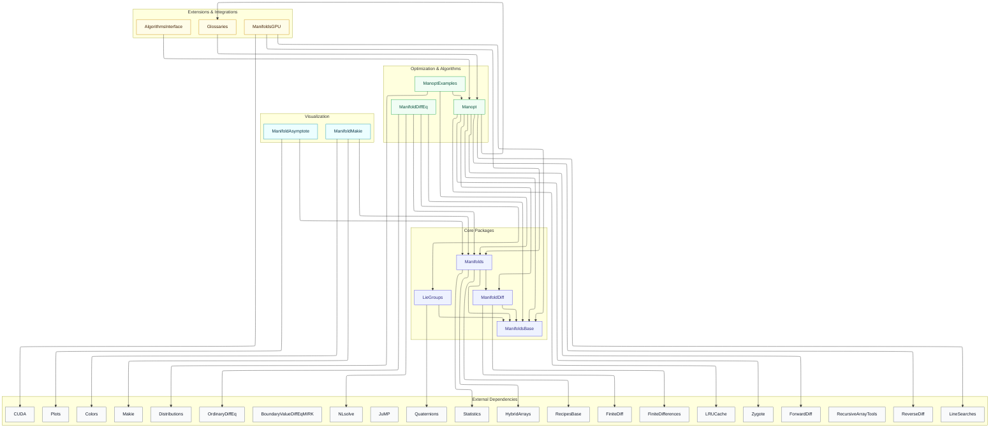

# Julia Manifolds

The [GitHub Organisation Julia Manifolds](https://github.com/JuliaManifolds)
develops [Julia]() packages involving numerical differential geometry.
Our main interface is [ManifoldsBase.jl](https://juliamanifolds.github.io/manifoldsbase/stable/),
describing how to define a manifold.
The main package build upon that is a library of Riemannian manifolds, [Manifolds.jl](https://juliamanifolds.github.io/manifolds/stable/).
On the other hand we provide packages that provide tools for general manifolds using the main interface, like
[Manopt.jl](https://juliamanifolds.github.io/manopt/stable/) to perform optimization on Manifolds,
[ManifoldDiffEq.jl](https://juliamanifolds.github.io/manifolddiffeq/) to solve differential equations,
or [ManifoldDiff.jl](https://juliamanifolds.github.io/manifolddiff/stable/) to provide AD tools
for functions defined on manifolds.

While all these packages have their own documentation, they are aggregated here as well using
[MultiDocumenter.jl](https://github.com/JuliaComputing/MultiDocumenter.jl) to have a single place for all documentation, especially the overarching search functionality.
