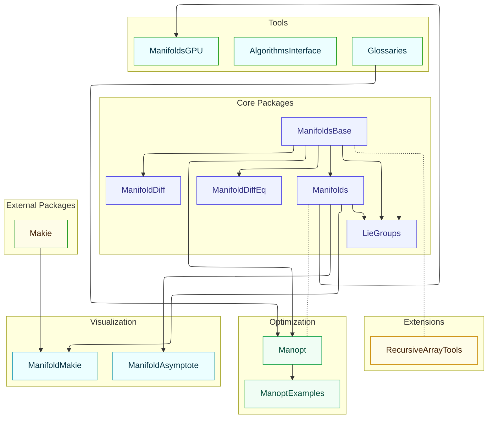

# Julia Manifolds

```mermaid
%%{init: {"layout":"elk"}}%%
flowchart TB
    %% -------------------------------------------------------------
    %% 1️⃣  Clusters – each gets its own colour via a class definition
    %% -------------------------------------------------------------
    classDef core        stroke:#4f46e5,fill:#eef2ff,color:#312e81;
    classDef optim       stroke:#16a34a,fill:#f0fdf4,color:#064e3b;
    classDef vis         stroke:#0891b2,fill:#ecfeff,color:#083344;
    classDef tool         stroke:#089100,fill:#ecfeff,color:#083344;
    classDef extend      stroke:#ca8a04,fill:#fefce8,color:#422006;
    classDef ext        stroke:#008a04,fill:#fefce8,color:#422006;

    subgraph Tools["Tools"]
        direction LR
        G[Glossaries]:::tool
        AI[AlgorithmsInterface]:::tool
        MGPU[ManifoldsGPU]:::tool
    end
    subgraph Extensions["Extensions"]
        RAT[RecursiveArrayTools]:::extend
    end
    subgraph Core["Core Packages"]
        direction TB
        MB[ManifoldsBase]:::core
        M[Manifolds]:::core
        MD[ManifoldDiff]:::core
        MDE[ManifoldDiffEq]:::core
        LG[LieGroups]:::core
    end
    MB --> LG
    MB --> M
    MB --> MD
    MB --> MDE
    M --> LG
    subgraph Optimization["Optimization"]
        direction LR
        MO[Manopt]:::optim
        MOE[ManoptExamples]:::optim
        MO --> MOE
    end
    MB --> MO
    M -...- MO
    subgraph Visualisation["Visualization"]
        MA[ManifoldAsymptote]:::vis
        MM[ManifoldMakie]:::vis
    end
    M --> MA
    M --> MM

    G --> MO
    G --> LG
    M --> MGPU
    MB -...- RAT
    subgraph External["External Packages"]
        Makie[Makie]:::ext
    end
    Makie --> MM
```
