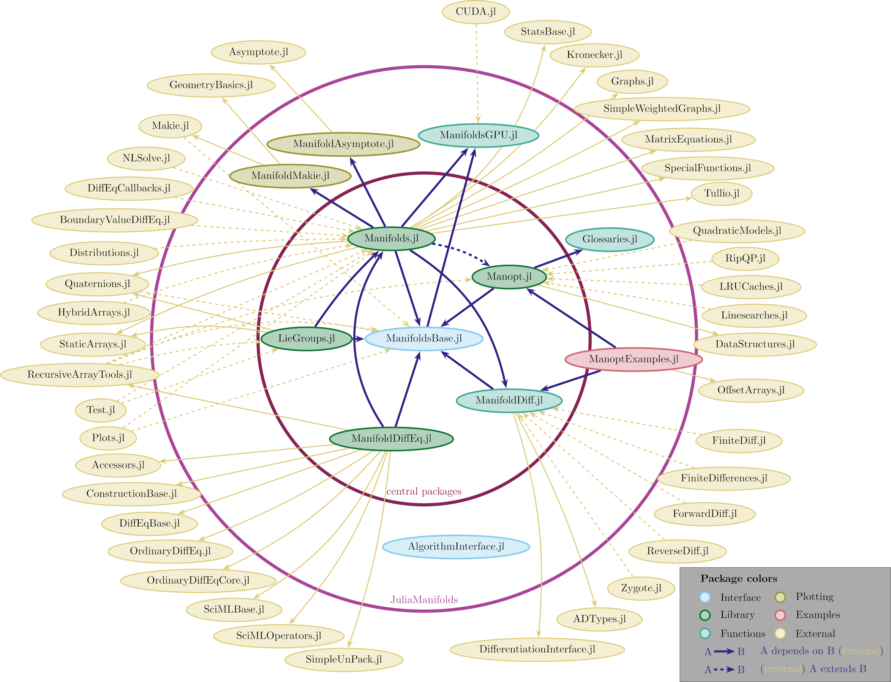

# Julia Manifolds

[JuliaManifolds](https://github.com/JuliaManifolds) is an ecosystem of [Julia]() packages
focusing on numerical differential geometry and provide these tools for researchers and engineers
for example from physics, robotics, statistics and other areas where [Riemannian manifolds](https://en.wikipedia.org/wiki/Riemannian_manifold), Lie groups and other geometric structures
appear in computations and numerical analysis.
Our goal is to provide these tools in an well-documented, efficient and accessible way.

## Overview of registered packages

The following diagram illustrated the interplay within the `JuliaManifolds` ecosystem and
dependencies and extensions into the Julia package ecosystem.

### ManifoldsBase.jl

[`ManifoldsBase.jl`](https://juliamanifolds.github.io/ManifoldsBase.jl/stable/)
provides an API of basic operations on manifolds relevant for numerical computations.
The main focus here is two-fold: On the one hand it allows to define new numerical algorithms
that work on abstract manifolds and just depend on the availability of e.g. a [retraction](https://juliamanifolds.github.io/ManifoldsBase.jl/stable/retractions/)
on such a manifold.
It also provides generic construction method for manifolds such as a [product manifolds](https://juliamanifolds.github.io/ManifoldsBase.jl/stable/metamanifolds/#ProductManifold),
[power manifolds](https://juliamanifolds.github.io/ManifoldsBase.jl/stable/metamanifolds/#sec-power-manifold) or the [tangent spaces](https://juliamanifolds.github.io/ManifoldsBase.jl/stable/metamanifolds/#Tangent-Space).
On the other hand it allows to define new manifolds that can be used in such algorithms.

### Manifolds.jl

[`Manifolds.jl`](https://juliamanifolds.github.io/Manifolds.jl/stable/)
provides a library of (primarily) Riemannian manifolds implemented using the interface provided by `ManifoldsBase.jl`.
Efficient implementations as well as a thorough documentation of the mathematical details
and usability are a main focus of this package.
The package is largely stable, although some new aspects of Riemannian manifolds are first experimented with in this package before
they are included in the generic interface.

### Manopt.jl

[`Manopt.jl`](https://manoptjl.org) implements algorithms to perform numerical optimisation
of cost functions defined on Riemannian manifolds using the interface provided by `ManifoldsBase.jl`.
The main focus here lies on efficient and modular implementation of the algorithms,
for example with modular [stopping criteria](https://manoptjl.org/stable/plans/stopping_criteria/),
[step sizes](https://manoptjl.org/stable/plans/stepsize/) or sub-solvers, such that these can easily
be exchanged and compared to other choices.

### LieGroups.jl

[`LieGroups.jl`](https://juliamanifolds.github.io/LieGroups.jl/stable/) extends the interface
of `ManifoldsBase.jl` to [Lie groups](https://en.wikipedia.org/wiki/Lie_group), i.e. manifolds equipped with a group structure.
It introduces for example the [Lie algebra](https://juliamanifolds.github.io/LieGroups.jl/stable/interface/algebra/),
[group operation](https://juliamanifolds.github.io/LieGroups.jl/stable/interface/operations/) and [group action](https://juliamanifolds.github.io/LieGroups.jl/stable/interface/actions/).
It also introduces general variants to construct Lile groups from these like the [semidirect product Lie group](https://juliamanifolds.github.io/LieGroups.jl/stable/groups/semidirect_product_group/#LieGroups.LeftSemidirectProductGroupOperation).
The focus lies on both an abstract way to define, but also an efficient implementation of Lie groups.
Again, a thorough documentation and testing of the Lie groups is provided as well.

### ManifoldDiffEq.jl

[`ManifoldDiffEq.jl`](https://juliamanifolds.github.io/ManifoldDiffEq.jl/stable/) provides solvers
for differential equations defined on either manifolds defined in [`Manifolds.jl`](https://juliamanifolds.github.io/Manifolds.jl/stable/)
or Lie groups from [`LieGroups.jl`](https://juliamanifolds.github.io/LieGroups.jl/stable/).
It is build using the [`OrdinaryDiffEq.jl`](https://docs.sciml.ai/DiffEqDocs/stable/) interface.

### ManifoldDiff.jl

[`ManifoldDiff.jl`](https://juliamanifolds.github.io/ManifoldDiff.jl/stable/) uses the [`DifferentiationInterface.jl`](https://juliadiff.org/DifferentiationInterface.jl/DifferentiationInterface/stable/) to define automatic differentiation (AD) rules on manifolds defined in [`Manifolds.jl`](https://juliamanifolds.github.io/Manifolds.jl/stable/) as well as a library of given gradients, differentials, Hessians, proximal maps etc.

### ManoptExamples.jl

[`ManoptExamples.jl`](https://juliamanifolds.github.io/ManoptExamples.jl/stable/) is a collection of
examples of optimisation tasks that are solved using solvers from
[`Manopt.jl`](https://manoptjl.org). The ingredients like objectives, gradients, proximal maps,
are defined, documented and tested in this package as well.

### ManifoldsGPU.jl

[`ManifoldsGPU.jl`](https://juliamanifolds.github.io/ManifoldsGPU.jl/dev/) aims to provide GPU
support for manifolds defined in [`Manifolds.jl`](https://juliamanifolds.github.io/Manifolds.jl/stable/).
For now, the support is provided for CUDA mainly using [`CUDA.jl`](https://juliagpu.org/backends/cuda/).

### ManifoldMakie.jl

[`ManifoldMakie.jl`](https://juliamanifolds.github.io/ManifoldMakie.jl/stable/) combines the manifolds from [`Manifolds.jl`](https://juliamanifolds.github.io/Manifolds.jl/stable/) with plotting recipes from [`Makie.jl`](https://makie.org/) to provide easily accessible visualization methods for manifold-valued data.

### ManifoldAsymptote.jl

[`ManifoldAsymptote.jl`](https://juliamanifolds.github.io/ManifoldAsymptote.jl/stable/)
follows a similar idea as the previous package, just that the rendering is done using [Asymptote](https://asymptote.sourceforge.io/).
The code of this package is a bit outdated and not very flexible. This package should be considered legacy code.

### Glossaries.jl

[`Glossaries.jl`](https://juliamanifolds.github.io/Glossaries.jl/stable/) is a package to define
a glossary of term to be used within a documentation. This is especially meant for the case, where
one keyword or argument is used relatively often. Then it is beneficital to store its name, description and default value
in the glossary only once and reuse this one definition throughout a documentation.
This is used within the documentation of [`Manopt.jl`](https://manoptjl.org)

### AlgorithmsInterface.jl

[`AlgorithmsInterface.jl`](https://juliamanifolds.github.io/AlgorithmsInterface.jl/stable/) is a package to define a unified interface to define iterative algorithms. It started in a similar fashion as [`ManifoldsBase.jl`](https://juliamanifolds.github.io/ManifoldsBase.jl/stable/) to define a general API for algorithms that [`Manopt.jl`](https://manoptjl.org) could use.
Currently the package is still in an early phase and [`Manopt.jl`](https://manoptjl.org) was not yet refactored to use this package.